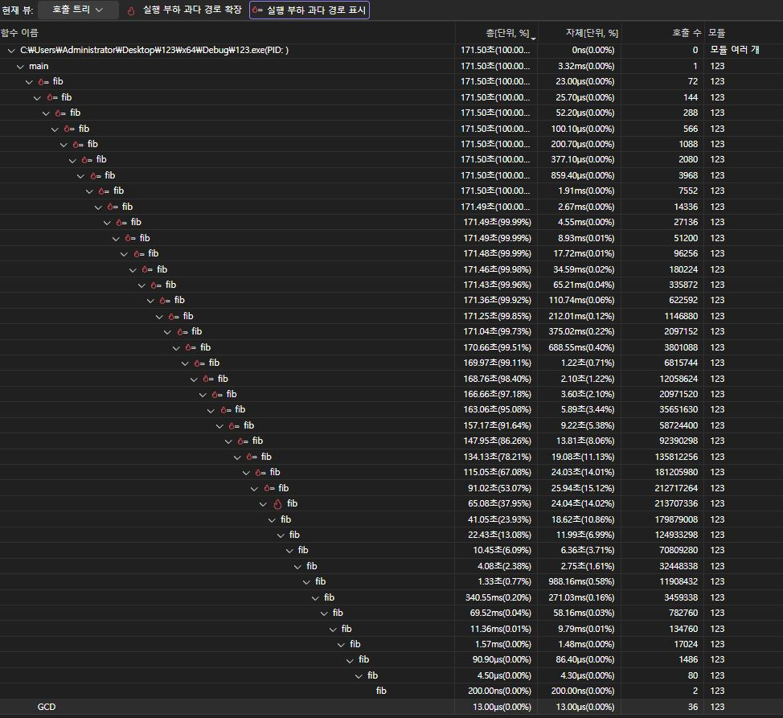
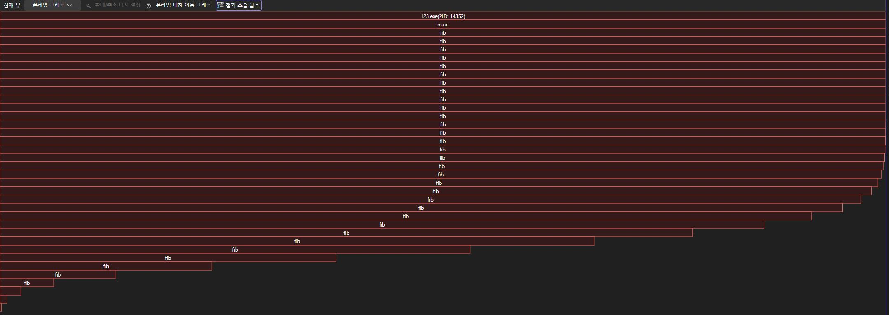

#include <stdio.h>
typedef unsigned long long ul;

ul fib(ul a) {
	if (a <= 1) {
		return a;
	}
	return fib(a - 1) + fib(a - 2);
}

ul GCD(ul a, ul b) {
	while (b != 0) {
		ul temp = a % b;
		a = b;
		b = temp;
	}
	return a;
}

int main() {
	for (ul i = 5;i<=40;i++) {
		ul q1 = fib(i);
		ul q2 = fib(i - 1);
		ul q3 = GCD(q1, q2);
		printf("%llu %llu번째\n", q3,i-4);
	}
}

해당 코드는 피보나치 수열의 5번째 숫자부터 시작하여 40번째 숫자까지 구하고, 이를 GCD 함수에 GCD(n, n-1) 형태로 사용하여 최대공약수를 찾고, 최종적으로 "최대공약수, n-4번째" 를 출력하는 코드임.

Big-O 계산:
	fib 함수는 호출될 때 마다 다시 fib(a-1), fib(a-2)를 호출하고, 반복될 때 마다 a가 1씩 늘어나는 형태이기에 호출되는 횟수가 기하급수적으로 늘어나는 이진트리 구조를 형성함. 고로, 해당 코드의 Big-O는 O(2^n)으로 볼 수 있음.

함수 호출 횟수, 소요 시간

플레임 그래프

위의 사진들을 종합해 봤을때, 피보나치 수열을 구하는 fib 함수는 반복 횟수가 증가할수록 소요되는 시간과 재귀로 인한 함수의 호출 횟수가 지수 형태로 증가하여 호출수가 약 2100만번에 달하는 구간이 존재함.
고로, 피보나치 수열의 시간 복잡도는 O(2^n)으로 볼 수 있음.

GCD 함수는 cpu 사용량의 100%를 차지하는 fib 함수에 비해 매우 적은 점유율을 차지하여 그래프에 나타나지 않았음.
또한, 프로그램 실행에 총 171.50초를 사용하였는데, GCD 함수에는 13마이크로초밖에 사용하지 않았음.
이는 이전에 구한 GCD 함수의 시간 복잡도가 O(log n)임을 증명할 수 있고, 무시할 수 있을 정도의 부하라는 것을 나타냄.